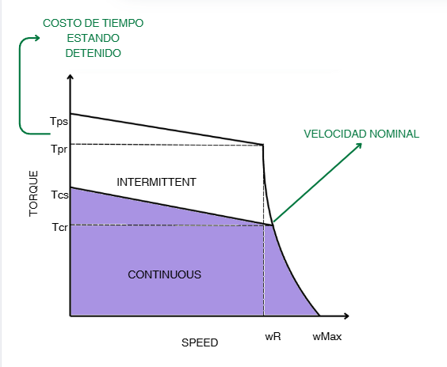
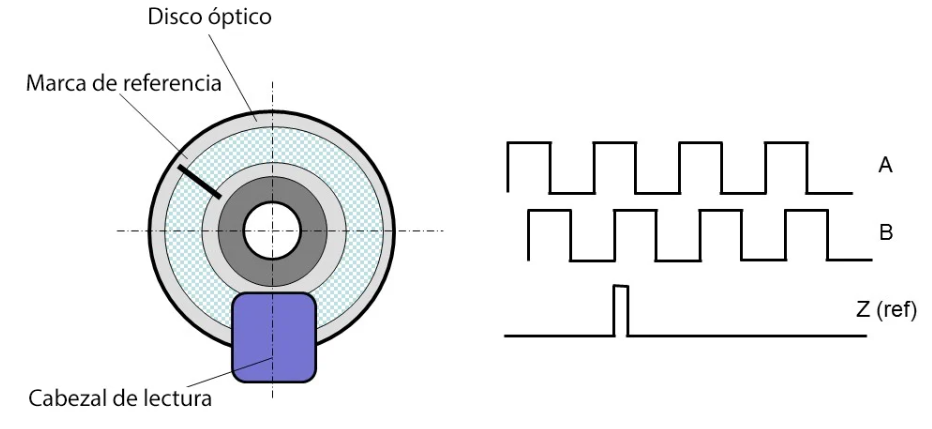
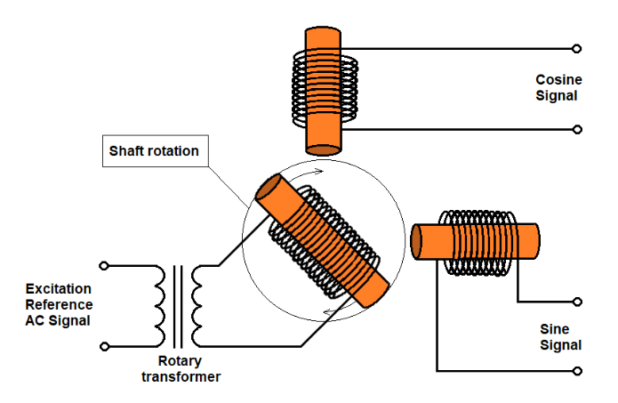
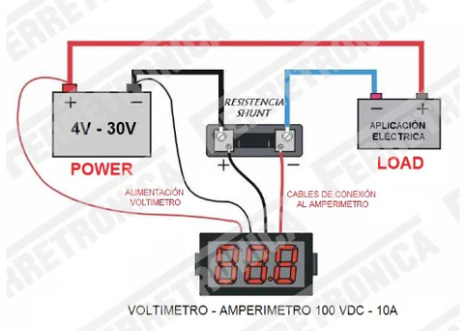
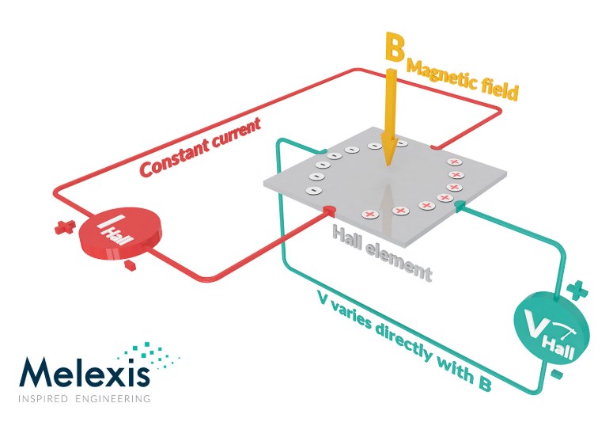
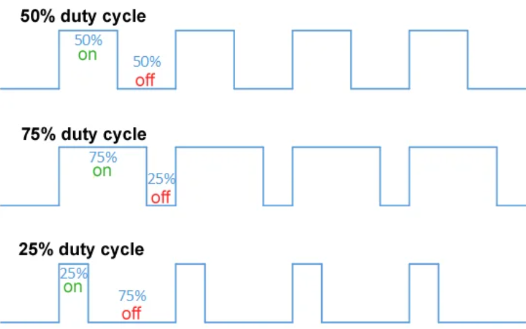

# CONTROL DE MOVIMIENTO - CLASE_3
# Motores

Los motores son dispositivos diseñados para convertir energía en movimiento mecánico. Se pueden clasificar en diferentes tipos según su fuente de energía y su principio de funcionamiento.
##
### Servomotor
Servo, palabra que hace referencia a que una variable se mueve hacia un valor objetivo en el dominio del tiempo, viene de la palabra latina "servos" cuyo significado es esclavo, sigue comandos de posición, velocidad o torque por medio de un sistema de control, estas mismas son las variables a controlar.  

Componentes
1. Sección de comando: Controlador
2. Sección de controlador: Amplificación de servo
3. Sección de controlador y etector: Motor de servo
##
## Tipos de motores
### Motores DC
Utiliza una fuente de corriente continua para generar movimiento rotatorio.

**Partes**  

-Estator : Es el encargado de generar el campo magnético de excitación. Está compuesto por una corona de material ferromagnético llamada culata , dentro de la cual se encuentran los polos. Alrededor de estos polos se enrollan los devanados de excitación que generan el campo magnético cuando una corriente circula por ellos.

-Rotor : Es una pieza cilíndrica ranurada hecha de material ferromagnético. En las ranuras del rotor se aloja el devanado inducido cerrado , que es donde se genera el movimiento cuando el motor está en funcionamiento.  

-Colector de delgas : Se trata de un conjunto de láminas de cobre aisladas entre sí, que giran junto con el rotor. Estas láminas están conectadas eléctricamente a los bobinados del devanado inducido y permiten la conexión del motor con el exterior.

**Aplicaciones**

-Molienda de caña de azucar  
-Cintas transportadoras 

##

### Motor de corriente alterna (AC) 
##
#### Motor síncrono  

**Definición :** Son máquinas eléctricas cuya velocidad de rotación está vinculada a la frecuencia de la red AC. La velocidad del rotor y la velocidad del campo magnético del estator son iguales. Posee imanes o bobinas montadas sobre el rotor, las cuales se excitan con corriente continua. Las bobinas de armadura están divididas en tres partes y se alimentan con corriente trifásica.

**Partes :**   

-Estator : Contiene un bobinado trifásico que genera el campo magnético giratorio.   
-Rotor : Puede tener imanes o bobinas de excitación alimentadas con corriente continua, lo que le permite girar a la velocidad del campo magnético.  
-Anillos rozantes : Son anillos metálicos que permiten la alimentación de corriente continua al rotor.  

**Funcionamiento :**

-Para iniciar el motor, se aplica una señal alterna trifásica al estator.  
-Se suministra corriente continua a las bobinas del rotor, lo que genera un campo magnético con polaridad fija.  
-La interacción entre el campo magnético del estator y el del rotor produce el giro del ro.  

**Aplicaciones:**  
-Bombas.  
-Laminación siderúgica
##
#### Motor asíncrono  

**Funcionamiento:** El motor asíncrono genera un campo magnético giratorio en el estator, que al inducir corrientes en el rotor produce fuerzas electromagnéticas. Estas corrientes generan una reacción que permite el giro del motor a una velocidad inferior a la de sincronismo.

**Motor jaula de ardilla**  

  

**Motor rotor bobinado**  

**Aplicaciones:**  
-Bombas  
-Sopladores de aire  
-Cintas transportadoras  
-Extractores de aire

## Características de los Motores

| Tipo             | Ventajas | Desventajas |
|-----------------|----------|-------------|
| **DC**          | - Control más simple    - Driver de potencia más simple   - Bajo precio en bajas capacidades   - Alta eficiencia en aplicaciones pequeñas | - Requiere mantenimiento e inspección periódica   - No se usa en ambientes sucios o húmedos   - No se debe utilizar para aplicaciones de frenado intenso   - Puede sufrir desmagnetización con el tiempo |
| **AC - Inducción** | - Poco mantenimiento   - Excelente resistencia al entorno   - Alta velocidad y alto torque   - Alta eficiencia en aplicaciones grandes   - Estructura robusta | - Baja eficiencia en aplicaciones pequeñas   - Poca facilidad de control comparado con el DC   - Puede sufrir cambios en sus características debido a temperaturas |
| **AC - Síncrono** | - Muy poco mantenimiento   - Excelente resistencia al entorno   - Compactos y ligeros   - Alta eficiencia en todo tipo de aplicaciones | - Control de dificultad intermedia   - Se requiere un inversor o driver más potente   - Si no se maneja bien, puede sufrir desmagnetización con el tiempo |

## Zona de operación 

**Motores AC Síncronos lazo cerrado**   

  

**Motores AC Asíncronos lazo cerrado**   

## Modelo por cierre de armadura

**Parte Eléctrica**  

$$v_a=L_a\dot{I_a}+R_aI_a+V_b$$  

**Parte Magnética**  

$$T_m=(K_aK_cI_c)I_a(t)=K_tI_a(t)$$  

$$V_b=K_e\omega$$  

$$T_m=T_c+T_p$$  

**Parte Mecánica**  

$$J\frac{d^2\theta}{dt^2}+b\frac{d\theta}{dt}+k\theta=\tau(t)$$  

$$L_a\frac{d}{dt}\left(\frac{J\ddot{\theta}+b\dot{\theta}+k\theta}{K_{\tau}}\right)+R_a\left(\frac{J\ddot{\theta}+b\dot{\theta}+k\theta}{K_{\tau}}\right)+K_e\dot{\theta}=v_a$$

## Sensores  
Miden:  
-Corriente (torque)  
-Posición  
-Velocidad

### Posición  
##
#### Encoders
| Elemento         | Encoder Incremental                                  | Encoder Absoluto                                                             |
|-----------------|------------------------------------------------------|----------------------------------------------------------------------------|
| **Salida**      | Salida aumenta incrementalmente                      | Hay posiciones absolutas en una revolución                                 |
| **Reinicialización** | Operación de retorno durante encendido           | No requiere ninguna operación de retorno ya que se sabe siempre su posición dentro de una revolución |
| **Precio**      | Bajo                                                 | Alto                                                                       |
| **Estructura**  |   |                              |
| **Adicionales** | Solamente se detectan pulsos                         | Hay un código perforado en el encoder. El más usado es Gray               |

#### Resolver  
Es un sensor analógico de posición angular con un rotor y un estator, cuya amplitud de señal varía según su posición relativa. Funciona de manera similar a un transformador y puede tener o no escobillas. Sus voltajes oscilan entre 2V y 40V RMS, con frecuencias de 50 Hz a 20 kHz. La relación de transformación entre el devanado primario y secundario varía entre 0.2 V/V y 1 V/V.  

   

### Torque  
| Tecnología del sensor   | Resistencia Shunt | Sensor de efecto Hall |
|-------------------------|-------------------|-----------------------|
| **Estructura**         |  |  |
| **Coste**              | Muy bajo          | Alto                  |
| **Linealidad en el intervalo de medición** | Muy buena | Pobre |
| **Capacidad de medir altas corrientes** | Muy baja | Buena |
| **Consumo de energía** | Alto | Medio |
| **Problema de saturación** | No | Sí |
| **Medida de corriente continua** | Sí | Sí |
| **Medida de corriente alterna** | Sí | Sí |
| **Rango de medidas** | 6000A | 0-1000A |

### Drivers de potencia  

Un driver de potencia amplifica señales eléctricas de control para convertirlas en señales de alta potencia, permitiendo la alimentación de actuadores como motores. Cada eje requiere su propio driver y controlador. En servomotores modernos, el controlador gestiona la retroalimentación de posición y velocidad, mientras que el driver recibe la retroalimentación de corriente.  

El control del driver se realizará mediante modulación por ancho de pulso (PWM), un estándar en la industria tanto para motores DC como AC. 

### Conclusiones
Los motores desempeñan un papel fundamental en la tecnología moderna, permitiendo la automatización y el transporte en diversas industrias. Su correcta selección depende del tipo de aplicación y los requerimientos energéticos.

### Referencias
1. Autor 1. *Fundamentos de motores eléctricos*. Editorial, Año.
2. Autor 2. *Motores de combustión interna y su aplicación*. Revista, Volumen(Número), Año.
